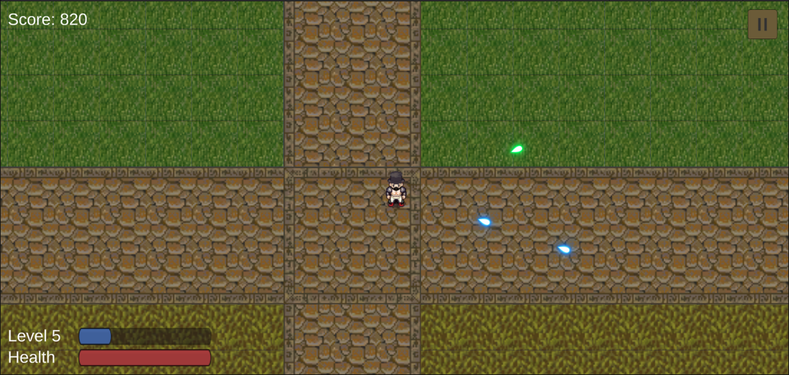
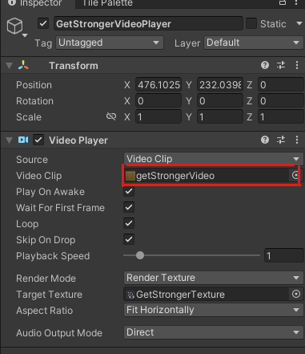

## How to set up
Ensure that you have git installed. Also ensure that you have Unity 2021.3.17f1 installed. Later versions may work as well, but that is the version the game was developed in. We have not tested it in other versions. Be sure to clone the repository into a desired folder. 
Open the project using unity hub. It may prompt you to install some extra things if it is your first time using Unity hub. The first open will take much longer than the rest due to Unity downloading necessary files. 
You may also need to add the scenes to the build settings. You can find this in File > Build settings. There are three scenes to add: MainMenu, InstructionsScene, and TophatSurvivor. They need to be in this order in the list. 

## How to play test
Unity hub should open the game to the main menu screen. YOU NEED TO START FROM THIS SCENE. If it does not open this screen, you can find it at Project 1/Assets/Scenes/MainMenu.unity. 

From here you have the option to either play a new game, load your previous save, check the instructions or quit the game. Your character will now spawn in the middle of the map to. Utilize WASD keys to move, and use your mouse cursor to aim your bullets. Enemies will spawn at different spots in the map and chase you. When they make contact with you, you will lose health, indicated at the bottom left. When you kill an enemy, they will drop an orb which will increase your character's experience and score. Once you reach 0 health, the game will end

## Creating the Main menu
The main menu was built using the UI builder provided by Unity. Check to see if this is installed for you. If it is not, you must install it by adding com.unity.ui.builder and com.unity.ui. 
You can use our UI object in our MainMenu scene to create a similar system to start new game, load save, instructions and quit the game. You just need to edit the names of the scenes in the MainMenuController.cs file to open the correct scenes and load the correct information. 

## Creating Instructions
The instructions scene consists of a background, text on top of an image, and a few buttons. You can opt to use this entire scene for your instructions. You can opt to change the images of the background, and the image the text is layed over to match your game. You can do this by just changing the source images. The buttons will work no matter what, but is designed only for two pages of instructions. You can choose to edit the text game objects to suit the needs of the game. You can also change the videos of the demonstrations by changing the video clip in the corresponding VideoPlayer. 

## Creating your HUD
Your HUD (Heads up display) is connected with your player. It consists of the health, level, and score. The hud is connected to the PlayerAttributes.cs script. You can find this in Project 1/Assets/Scripts. You can add this script to your player to ensure that they have specific attributes. With your HUD connected with this script in your player, whenever you make contact with an enemy you will lose HP, and when you pick up an XP or HP orb, you will gain experience, health and score. They XP and HP orbs need to have the tags "xp" and "hp" respectively to work. 

## Creating your pause menu and death screen screen
Both the pause menu and the death screen are very similar. They both consists of a panel that is initially set inactive. Based on different actions, they will become active (visible). The pause menu shows when the pause button or "escape" is pressed. The death screen appears when the player's health reaches 0. Both of them consists of buttons that will take you to the corresponding screens. You can change this in the Pausemenu.cs file to load whatever scenes you wish. 

## Saving / SaveManager Script
Saving is done by putting the stats of the player in a gameobject initially in the Mainmenu scene. This needs to be done to ensure the player can load and start a new game properly. You can create an empty object and attach a SaveManager script to it. You can find this script in Project 1/Assets/Scripts/Saving. Our Player object will interact with this object to get its attributes and saves. 

## Movement script
The movement script can be dragged onto any game object you would like to move around with WASD check the Player object on our game to see how to setup a character. the movementSpeed field can be changed to change the objects movement speed and the Animator field can have an animator draged onto it to link the animations with the movement.

## EnemyMove script
this script causes the gameobject to move towards the player object. movement speed field is set with movementSpeed, enemy sprite used for animation is draged into SpriteRenderer, rigidbody of the gameobject is dragged into enemyPhysiscs. for an example of this check either of the enemy prefabs.

## Shoot script
The shoot script is used to have a game object shoot a projectile prefab in this case we can use a friendly bullet or enemy bullet. to use the script first add it to the object you would like to shoot. the shootspot is the location where the bullet will be fired from you can drag on the location of the player or a gun they are holding if you have one. the bullet field will require you to drag on the bullet prefab you are using and the bullet random can be the same or different prefab this is for the random direction bullet that is unlocked after hitting level 5. you can also change the base firerate. see player or one of the enemy prefabs for an example how this works.

## Bullet, Enemy bullet, and BulletRandom script
the bullet script is used with a prefab of your choice to create a projectile that damages enemies on contact. bulletPhysics requires you to drag the rigidbody of your bullet into it. bullet also has the ability to change the projectiles shotspeed range and damage through the fields. Enemy bullet works the same way but damages players instead of enemies. BulletRandom works the same way but fires the bullet in a random direction damaging enemy on contact. see the Pistol Bullet Pistol BulletRand or EnemyBullet prefab for an example of how this works.

## spawnEnemies Script
spawns enemies with spawn rate increasing based on player level. Drag the base enemy prefab you want to spawn into enemy and the boss you want to spawn at player level 5 and higher into bos. Use this script on the player. Check out the player for an example how to use this script. 

## Enemy Script
this script sets up your enemy prefab with its health, and death. drag the animator for your enemy into animator to set the death animation, drag the prefab for your experiance into XpOrb and prefab for health pickup into heart. drag the tranform of the prefab into enemy location and set the health of your enemy using the enemyHealth field. see any of the enemy prefabs to see how this works.

##PlayerAttribute Script
This script is crutial in giving your character the attributes and saving as well. Drag this script into your player gameobject. Also drag in the appropriate gameobjects into the correct serialized fields to ensure the player is intereacting with the score and HUD. See the Character gameobject for an example. 

##PauseMenu Script
This script handles all the buttons in the pause screen, along with freezing the game once the pause is hit and unfreezing when the game is resumed. There are various functions in this script that you can use in any buttons in order to do pause-menu related things. You can drag and drop this script into any element in your pause canvas. You need to assign your buttons to the corresponding functions within this script. See the PauseButton for an example. 
